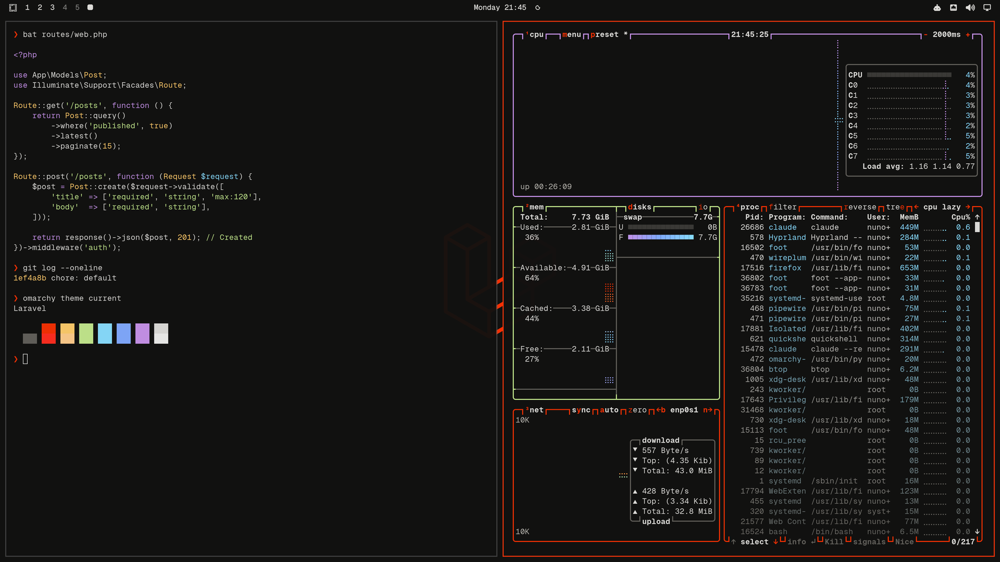

# Laravel theme for Omarchy

A dark [Omarchy](https://omarchy.org) theme that brings the look and feel of
[laravel.com](https://laravel.com) to your desktop: warm sand neutrals,
Laravel red as the accent, and the syntax colors from the Laravel docs.



## Install

```bash
omarchy theme install https://github.com/nunomaduro/omarchy-laravel-theme.git
```

Omarchy clones the repo into `~/.config/omarchy/themes/laravel` and applies it.
Afterwards you can switch back and forth with:

```bash
omarchy theme set laravel
```

Cycle wallpapers with `omarchy theme bg next`, and pick the matching boot
splash from the Omarchy menu under Style > Unlock.

## Palette

Every value comes from laravel.com's stylesheet or the official
[laravel/art](https://github.com/laravel/art) logo files.

| Role | Hex | Source |
| --- | --- | --- |
| Background | `#111110` | sand-dark-1, the docs page background |
| Lighter background | `#222221` | sand-dark-3, the docs code block background |
| Foreground | `#dddcd9` | between sand-dark-11 and sand-dark-12 |
| Bright foreground | `#eeeeec` | sand-dark-12, body text |
| Muted | `#62605b` | sand-dark-8 |
| Accent / red | `#f53003` | `--color-laravel-red` |
| Bright red | `#ff2d20` | logo red from laravel/art |
| Yellow | `#ffcb6b` | docs syntax highlighting |
| Orange | `#f78c6c` | docs syntax highlighting |
| Green | `#c3e88d` | docs syntax highlighting |
| Cyan | `#89ddff` | docs syntax highlighting |
| Blue | `#82aaff` | docs syntax highlighting |
| Magenta | `#c792ea` | docs syntax highlighting |

## What is included

- `colors.toml`: the palette above. Omarchy generates the terminal, Neovim,
  VS Code, btop, Chromium, Hyprland and shell configs from it.
- `backgrounds/`: three 4K wallpapers built from the official logo mark.
- `unlock.png` and `preview-unlock.png`: Plymouth boot splash logo and preview.
- `icons.theme`: Yaru-red.

## Credits

Laravel and the Laravel logo are trademarks of Laravel Holdings Inc. This
theme is a community project and is not affiliated with or endorsed by Laravel.
Logo artwork comes from [laravel/art](https://github.com/laravel/art).
